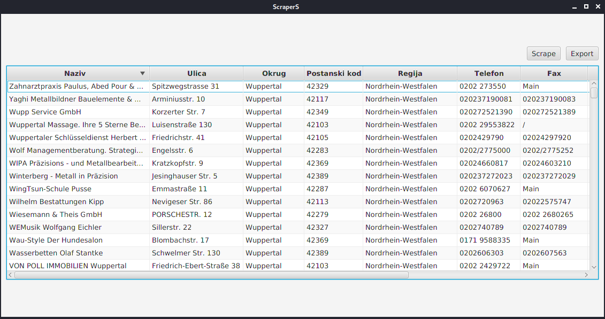

# ScraperS
## Specific website Scraper written in java. 
ScraperS is simple application which scrapes company data from specific website.
When the application finishes scraping, scraped data will be shown inside a table.
GUI is very simple it's made using JavaFX library.
User can start new scraping session whenever he wants to and export scraped data
to csv also.

Scraper is written using Jsoup library, it uses hardcoded user agent and random
generated timeout to simulate user activity. This process can be done better by
switching user agents and proxies for every new connection that's made. 
